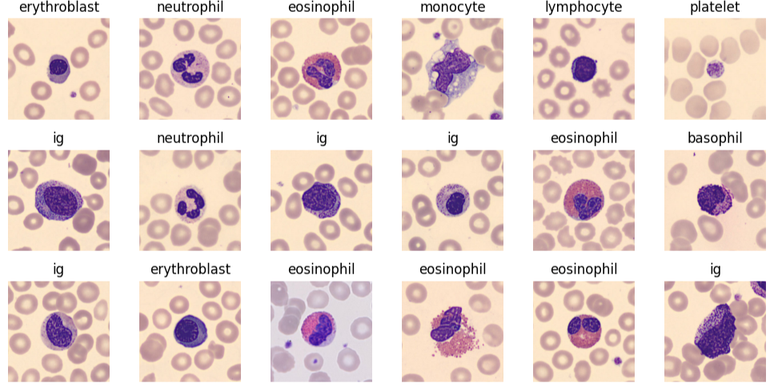
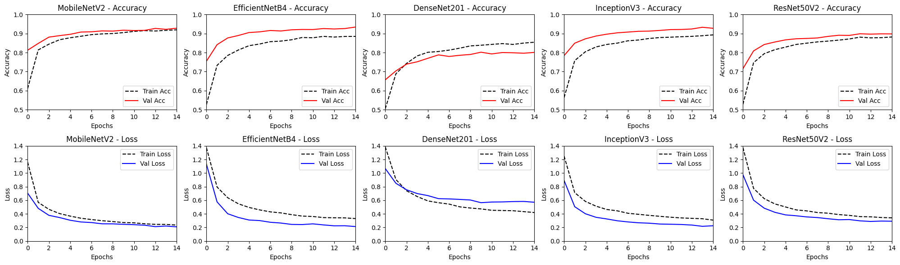

# Blood Cell Type Classification

Classification of 17,092 blood cell images into 8 cell types using transfer learning from five pre-trained CNN architectures in TensorFlow, achieving up to **94.53% test accuracy**.

---

## The Problem

Identifying blood cell types from microscopy images is a routine but time-consuming step in haematology. Manual classification is slow and subject to human variability. This project trains a deep learning model to automate that classification across eight clinically relevant cell types: neutrophils, eosinophils, basophils, lymphocytes, monocytes, immature granulocytes (IG), erythroblasts, and platelets.

---

## Results

| Model | Training acc. | Validation acc. | Test acc. |
|---|---|---|---|
| MobileNetV2 | 91.96% | 92.80% | 92.19% |
| **EfficientNetB4** | **88.51%** | **93.41%** | **94.53%** |
| DenseNet201 | 85.43% | 80.09% | 79.84% |
| InceptionV3 | 89.31% | 92.76% | 93.12% |
| ResNet50V2 | 88.20% | 89.81% | 90.31% |

EfficientNetB4 is the best model at **94.53% test accuracy**, with no signs of overfitting (training acc. 88.51% vs. val acc. 93.41%). DenseNet201 is the only model that shows a gap between training and validation accuracy, suggesting mild overfitting.

---

## Dataset

17,092 labelled images from the [Blood Cells Image Dataset](https://www.kaggle.com/datasets/unclesamulus/blood-cells-image-dataset/data) on Kaggle. The dataset is balanced across all 8 classes. Images were split 80-16-4 into train, validation, and test sets.

---

## Methodology

**Preprocessing and augmentation** -- each image is resized to the input size required by its architecture. During training, random horizontal and vertical flips, full-range rotation (0 to 2pi), translation (up to 20%), and zoom (up to 20%) are applied to improve generalisation. Pixel values are rescaled to the range expected by each base model ([-1, +1] for MobileNetV2, InceptionV3, and ResNet50V2; no rescaling for EfficientNetB4 and DenseNet201, which handle normalisation internally).

**Transfer learning** -- all five convolutional bases are loaded with ImageNet weights and frozen. Only the prediction head is trained. This keeps training fast while leveraging features learned from millions of images. No fine-tuning was performed.

**Prediction head** -- identical across all models for a fair comparison: Global Average Pooling -> BatchNorm -> Dense(128, ReLU) -> Dropout(0.2) -> Dense(8, Softmax).

**Training** -- Adam optimizer (lr=1e-4), sparse categorical cross-entropy loss, 15 epochs, batch size 64.

---

## Key findings

- EfficientNetB4 generalises better than larger models like InceptionV3 (21.8M params) and ResNet50V2 (23.6M params) despite having a similar parameter count (17.7M), pointing to its compound scaling design being better suited to this task.
- MobileNetV2, despite being the smallest model (2.3M params), reached 92.19% test accuracy, making it a strong candidate for deployment in resource-constrained environments.
- DenseNet201 underperformed all other models and showed a validation accuracy drop, suggesting it is not well-suited to this dataset without fine-tuning or regularisation.
- Introducing fine-tuning of the convolutional base or L1/L2 regularisation on the prediction layers are the clearest paths to pushing accuracy beyond 95%.

---

## Stack

- [TensorFlow / Keras](https://www.tensorflow.org) -- model building and training
- [scikit-learn](https://scikit-learn.org) -- confusion matrix evaluation
- [Matplotlib](https://matplotlib.org) / [Seaborn](https://seaborn.pydata.org) -- visualisation
- Google Colab (GPU runtime) -- training environment
